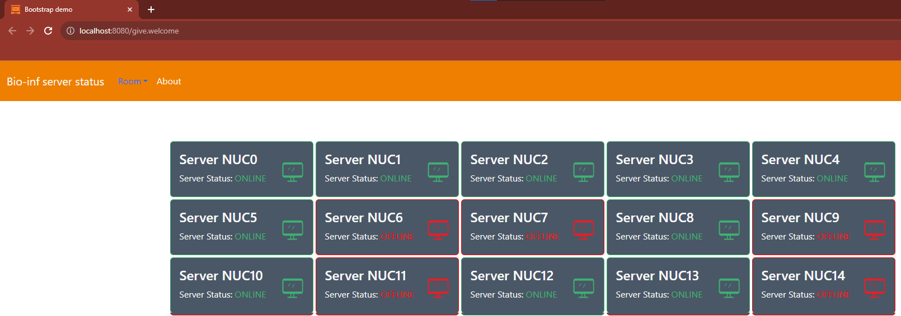

# Bioinf-Status-Page

In this repository,
you can find the code for the status page from the bioinformatics department at the Hanze University of Applied Sciences.

The website constains two main functions:

1. A status page (/home) that displays all workstations. Filtering, show additional information, hiding offline workstations is available here.
2. A map page (/map) that can display a map of workstations for each room separately

## About the project

The project was made by third year bioinformatics students. The task was to create a functional status page for the bioinformatics department.

## Tools used in this project


## Using the website

This website is easy to use and most features speak for themselves. The main page (/home) contains the main functionality of the website. Every workstation from a configuration file is visible. For every workstation, additional information can be shown by pressing a button "show status".

The map page (/map) displays a map of workstations for a given room. The map page can be reached using the navbar navigation. Simply press the button of the room you want to see the map from.

### SSH Suggestions

At the  top of the main page, you can find a selection of four workstation that can be used to connect to. These workstation are sorted by:

1. Status
2. Load
3. Memory
4. Temperature

The main purpose of the SSH Suggestions is to quickly provide information about which workstation is best to use to connect

By pressing the button "show me " you can get aditional information about the workstation.

## Contributors

- [Luka Stein - l.t.stein@st.hanze.nl](https://github.com/Coldbirdie)
- [Sibren Reekers - s.h.b.reekers@st.hanze.nl](https://github.com/SibrenReekers)
- [Mark Van de Streek - m.van.de.streek@st.hanze.nl](https://github.com/MarkStreek)

## Config file

The project is mosty relying on a configuration file. Inside this configuration file, every workstation from the department is storerd inside a room list. Additionally, every room contains a matrix where the map of the room is defined.

For example, look at configuration for room H188A below:

<pre style="color:#F07C01;">
"H188A": { "pc" : [
        "nuc504.bin.bioinf.nl",
        "nuc505.bin.bioinf.nl",
        "nuc503.bin.bioinf.nl",
        "nuc502.bin.bioinf.nl",
        "nuc501.bin.bioinf.nl"
      ],
        "classRoomMatrix":
        [
          ["nuc504", "null", "null"],
          ["nuc503", "nuc502", "nuc505"],
          ["nuc501", "null", "null"]
        ]
</pre>

As you can see, first there is a list of worksations inside the rooms. And then a matrix containing the map.

The "null" inside the matrix means there is no workstaion at that place in the room.

> Every room has the main projecting worksation (i.e., the teacher pc) at the top of the matrix. This way, every map can be readed in the same way.

### Moving a workstation

Beacuase we use a configuration file, it is very easy to move a workstation. The steps for moving a workstaion:

1. Remove the workstation from the "pc" list
2. Remove the workstation from the classRoomMatrix

However, a number of things must be met:

> 1. Make sure the classRoomMatrix does not contain a workstation that does not exist. This is the same for the "pc" list.
> 2. After moving a workstation, make sure the matrix dimensions are still the same. For example, you are moving a workstation that contains originally 6 rows with every row having 6 columns. After moving a workstation (removing), one row has 5 columns. Fill this gap with "null" to meet the conditions again.
> 3. It is possible to edit the dimensions of a classRoomMatrix, but make sure every row has the same amount of columns with no gaps.
>
## Project tree

Below is the main project tree

```bash
src/
└── main
    ├── java
    │   └── nl
    │       └── bioinf
    │           └── shbreekers
    │               ├── config
    │               │   ├── WebConfig.java
    │               │   └── XmlWebListener.java
    │               ├── model
    │               │   ├── MakeRequests.java
    │               │   ├── ParseJsonRequests.java
    │               │   └── Workstation.java
    │               └── servlets
    │                   ├── AboutServlet.java
    │                   ├── MainServlet.java
    │                   ├── MapServlet.java
    │                   └── RequestListener.java
    └── webapp
        ├── data
        │   └── config.json
        ├── images
        │   ├── favoicon_round.png
        │   └── HanzeLogo.jpeg
        ├── js
        │   ├── CreateMapOfRooms.js
        │   ├── createScrollButton.js
        │   ├── createSuggestionsCards.js
        │   ├── createWorkStationCards.js
        │   ├── main.js
        │   └── requests.js
        ├── style
        │   ├── sidebar.css
        │   └── viewport.css
        └── WEB-INF
            ├── templates
            │   ├── About.html
            │   ├── index.html
            │   ├── Map.html
            │   ├── Sidebar.html
            │   └── template.html
            └── web.xml

16 directories, 26 files
```

## Progress

The design of the status page changed a couple of times. Below are some examples of the first versions.

### Design-SNAPSHOT-1.0



### design-SNAPSHOT-1.1

